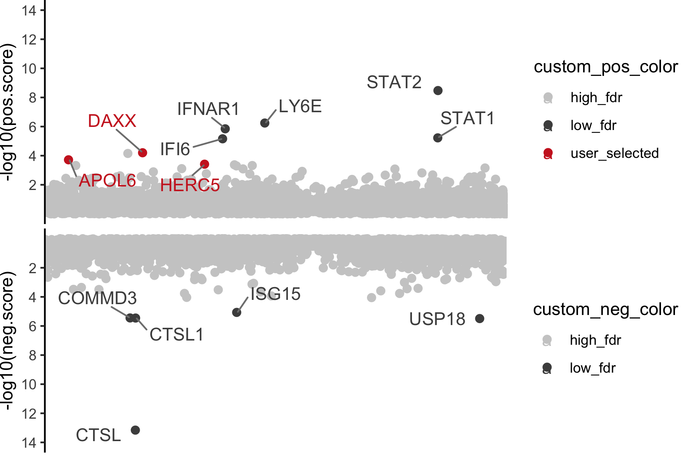

# ISG focused CRISPR/Cas9 knockout screen for SARS-CoV-2

This repository provides [MAGeCK](https://sourceforge.net/projects/mageck/) (DOI: [10.1186/s13059-014-0554-4](https://doi.org/10.1186/s13059-014-0554-4)) output of CRISPR/Cas9 ISG screen of cells infected or non-infected with SARS-CoV-2. Further details on the study methods and results are provided in the publication (DOI: XXXXXXXX)


*The R code used to generate the plot here [mageck_score_gene_plot.R](mageck_score_gene_plot.R)*

MAGeCK was run with the following command:
```bash
mageck test -k read_count_table.txt -t Lib_isg_sort -c Lib_isg_ctrl -n MageckLibISG_CoVclust --pdf-report --keep-tmp --sort-criteria pos
```

MAGeCK input data [read_count_table.txt](./mageck/read_count_table.txt) and default output are provided in [mageck_output](./mageck).

Sample description, raw sequencing data and mapping analysis are provided in GEO (GSE173418).
